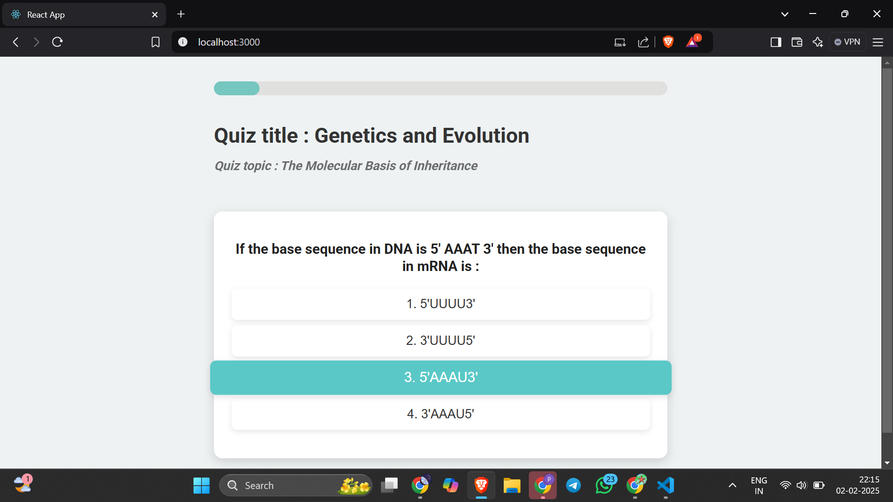
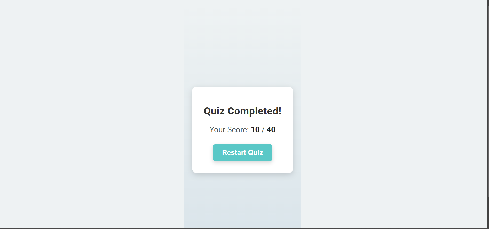

# Quiz Application with Gamification Features

## **Project Overview**
This is a web-based quiz application that integrates gamification features to enhance user engagement. The application fetches quiz data from an external API and presents it in an intuitive and interactive user interface. The app includes features like progress tracking, multiple-choice questions, and a results summary.

---

## **Features**
1. **Start Quiz**: Users can begin the quiz by clicking the "Start Quiz" button.
2. **Multiple-Choice Questions**: Each question has multiple options, and users can select one.
3. **Gamification Elements**:
   - Progress bar to track completion.
   - Points system for correct answers.
   - Negative marking for incorrect answers.
4. **Results Summary**: Displays the user's total score at the end of the quiz.
5. **Responsive Design**: The app is fully responsive and works on all screen sizes.

---

## **Tech Stack**
- **Frontend Framework**: React.js
- **Styling**: Styled-Components and CSS
- **API Integration**: Axios
- **Routing**: React Router

---

## **Setup Instructions**
Follow these steps to set up and run the project locally:

### 1. Clone the Repository
```bash
git clone <repository-link>
cd quiz-app
```

### 2. Install Dependencies
```bash
npm install
```

### 3. Run the Application
```bash
npm start
```

The application will be available at `http://localhost:3000`.

---

## **Folder Structure**
```
src/
├── components/        # Reusable components (e.g., ProgressBar, Question)
├── pages/             # Main pages (QuizPage, ResultsPage)
├── styles/            # CSS files for styling components
├── utils/             # Utility functions (e.g., API calls)
├── App.js             # Main application component
└── index.js           # Entry point of the application
```

---

## **API Integration**
The application fetches quiz data from the following API endpoint:
```
https://api.jsonserve.com/Uw5CrX
```
### Data Handling:
- Proper error handling is implemented to manage API failures.
- The data is parsed and displayed dynamically.

---

## **How to Use**
1. Start the quiz by navigating to the homepage (`/`).
2. Answer each question by selecting an option.
3. View your progress using the progress bar.
4. After completing all questions, view your total score on the results page.
5. Restart the quiz from the results page if desired.

---

## **Screenshots**
### 1. Quiz Page
Quiz Page



### 2. Results Page
Displays the user's score with an option to restart the quiz.



---


## **Future Enhancements**
1. Add a leaderboard to compare scores with other users.
2. Include a timer for each question to increase difficulty.
3. Add animations for better user experience.

---

## **Acknowledgments**
- API Data Source: [JSONServe](https://jsonserve.com)
- Inspiration: Testline App

---

